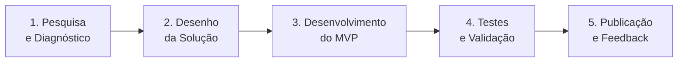
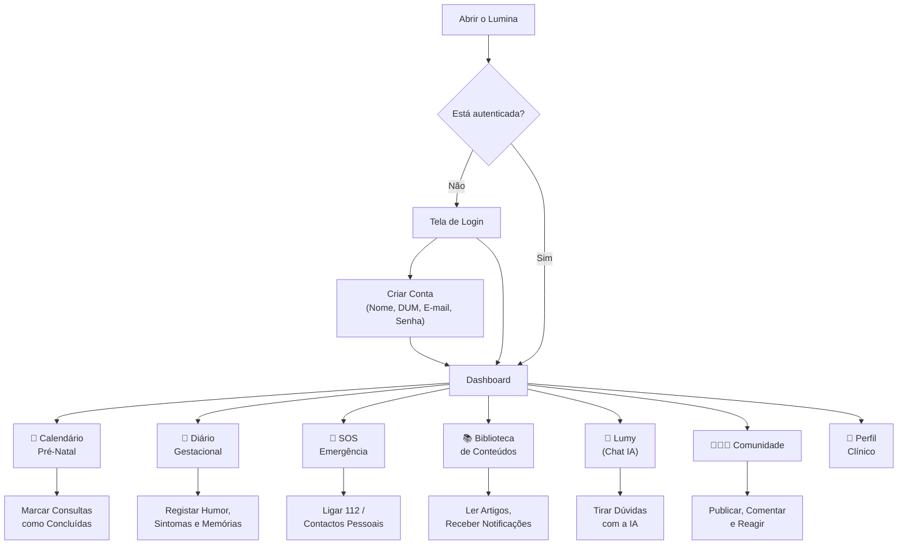

# 🌟 LUMINA — Acompanhamento Materno Inteligente

## Documentação do Projeto para Apresentação Científica

---

## 1. Identificação do Projeto

| Campo | Detalhe |
|---|---|
| **Nome** | Lumina — Acompanhamento Materno Inteligente |
| **Slogan** | *"O teu guia seguro e inteligente na maternidade"* |
| **Público-Alvo** | Gestantes angolanas, com foco inicial na Província do Uíge |
| **Tipo** | Aplicação digital de saúde materna (PWA + App Móvel) |
| **Plataformas** | Web (Progressive Web App), Android e iOS |
| **Desenvolvedor** | TaketWare |
| **URL de Acesso** | https://lumina.web.app |
| **Estado Atual** | Protótipo funcional (MVP implementado e operacional) |

---

## 2. Problemática

### Contexto Geral

A mortalidade materna e neonatal em Angola continua a ser uma das mais altas do mundo. Segundo dados da OMS e do Ministério da Saúde de Angola, muitas das complicações e mortes maternas poderiam ser prevenidas com **acompanhamento pré-natal regular, educação em saúde materna e acesso rápido a serviços de emergência**.

### Problemas Identificados

| Problema | Impacto |
|---|---|
| **Baixa adesão ao pré-natal** | Muitas gestantes não completam o mínimo de consultas recomendadas pela OMS (mínimo 8 consultas) |
| **Falta de informação acessível** | Mitos e desinformação sobre gravidez circulam livremente, substituindo orientações médicas confiáveis |
| **Dificuldade de reconhecer sinais de alerta** | Gestantes não sabem identificar sinais de perigo (sangramento, febre alta, redução dos movimentos fetais), atrasando o atendimento de emergência |
| **Isolamento materno** | Muitas mães enfrentam a gestação sem uma rede de apoio emocional estruturada |
| **Barreiras geográficas e de conectividade** | Em regiões rurais, o acesso a unidades de saúde e à internet estável é limitado |
| **Ausência de ferramentas digitais contextualizadas** | As poucas apps de gravidez existentes foram concebidas para realidades europeias ou americanas, sem considerar o contexto angolano |

### Pergunta de Partida

> **Pode uma aplicação digital, acessível e contextualizada à realidade angolana, contribuir para a melhoria do acompanhamento pré-natal e a redução de riscos para gestantes e recém-nascidos?**

---

## 3. Hipóteses

1. **Hipótese 1 — Adesão ao Pré-Natal:** A utilização de um calendário automático de consultas com lembretes visuais pode aumentar a adesão das gestantes ao cronograma de consultas pré-natais.

2. **Hipótese 2 — Educação em Saúde:** O acesso a conteúdos educativos sobre nutrição, saúde e mitos da gravidez, contextualizados à realidade angolana, pode melhorar o nível de literacia em saúde materna das utilizadoras.

3. **Hipótese 3 — Resposta a Emergências:** A disponibilização de um módulo de SOS com contactos de emergência pré-configurados e sinais de alerta pode reduzir o tempo de resposta em situações de risco obstétrico.

4. **Hipótese 4 — Bem-estar Emocional:** A existência de um diário gestacional e de uma comunidade de mães pode contribuir para o bem-estar emocional das gestantes, reduzindo o isolamento.

5. **Hipótese 5 — Assistente Virtual:** Uma assistente de inteligência artificial, treinada especificamente para o contexto materno angolano, pode esclarecer dúvidas comuns das gestantes de forma imediata e acessível, sem substituir a consulta médica.

---

## 4. Objetivos

### Objetivo Geral

Desenvolver uma ferramenta digital acessível e contextualizada que apoie gestantes angolanas durante toda a gravidez, promovendo a adesão ao pré-natal, a educação em saúde materna, o bem-estar emocional e a resposta rápida a emergências obstétricas.

### Objetivos Específicos

1. **Calcular automaticamente** a idade gestacional, o trimestre e a data provável do parto (DPP) com base na Data da Última Menstruação (DUM).

2. **Gerar um calendário automático** de 13 consultas pré-natais, seguindo o protocolo de frequência (mensal → quinzenal → semanal), ajustando automaticamente as datas para dias úteis.

3. **Disponibilizar um diário gestacional** onde a mãe possa registar o seu estado emocional, sintomas e memórias ao longo da gravidez.

4. **Criar um módulo de emergência (SOS)** com sinais de alerta obstétricos, ligação direta ao 112 e gestão de contactos de emergência pessoais.

5. **Oferecer uma biblioteca de conteúdos educativos** sobre nutrição, saúde, e mitos da gravidez, contextualizados à cultura angolana.

6. **Implementar uma assistente virtual (Lumy)** baseada em Inteligência Artificial, capaz de esclarecer dúvidas sobre a gestação de forma empática e em linguagem acessível.

7. **Promover uma comunidade de mães** onde as gestantes possam partilhar experiências e apoiar-se mutuamente.

8. **Garantir acessibilidade offline**, permitindo que o aplicativo funcione mesmo sem ligação constante à internet (funcionalidade PWA).

---

## 5. Metodologia

### Tipo de Estudo
Pesquisa aplicada com abordagem de desenvolvimento tecnológico e validação funcional.

### Fases do Projeto

| Fase | Descrição |
|---|---|
| **1. Pesquisa** | Levantamento bibliográfico sobre mortalidade materna em Angola, análise de ferramentas existentes, identificação das necessidades reais das gestantes |
| **2. Desenho** | Definição dos módulos, fluxo do utilizador, prototipagem das interfaces |
| **3. Desenvolvimento** | Construção do MVP funcional com as funcionalidades essenciais |
| **4. Testes** | Validação das funcionalidades, testes com utilizadoras reais |
| **5. Publicação** | Disponibilização da aplicação e recolha de feedback |

---

## 6. Módulos Implementados

O Lumina é composto por **9 módulos funcionais**, cada um desenhado para resolver um problema específico identificado na pesquisa.

---

### 6.1 📊 Dashboard (Tela Principal)

**Objetivo:** Dar à gestante uma visão imediata e clara do estado da sua gravidez.

**Funcionalidades:**
- Saudação personalizada com o nome da mãe
- Cálculo automático da **semana de gestação** com base na DUM
- Identificação do **trimestre** atual (1º, 2º ou 3º)
- **Data Provável do Parto (DPP)** — calculada automaticamente (DUM + 280 dias)
- Curiosidade dinâmica sobre o desenvolvimento do bebé em cada fase
- Localização da gestante (com opção de GPS automático)
- Acesso rápido aos módulos: Pré-Natal, Diário, SOS

**Relevância Clínica:** Permite que a gestante e o profissional de saúde acompanhem a evolução da gravidez de forma visual, prática e atualizada em tempo real.

---

### 6.2 📅 Calendário Pré-Natal (Módulo de Consultas)

**Objetivo:** Organizar e automatizar o cronograma de consultas pré-natais, reduzindo o esquecimento e incentivando a adesão.

**Funcionalidades:**
- Geração automática de **13 consultas pré-natais** a partir da data da 1ª consulta
- Cronograma dividido em 3 fases, seguindo as recomendações da OMS:

| Fase | Frequência | Consultas | Período |
|---|---|---|---|
| **Fase Mensal** | A cada 30 dias | 1ª a 7ª consulta | Até ao 7º mês |
| **Fase Quinzenal** | A cada 15 dias | 8ª e 9ª consulta | 8º mês |
| **Fase Semanal** | A cada 7 dias | 10ª a 13ª consulta | 9º mês até ao parto |

- **Ajuste inteligente**: as datas são automaticamente ajustadas para não caírem em fins de semana (sábados → sexta-feira, domingos → segunda-feira)
- Interface de **timeline visual** com marcadores coloridos por fase
- Botão para **marcar consulta como concluída** (persistido na base de dados)
- **Sinais de alerta** fixos no final (sangramento, dores de cabeça, febre, redução de movimentos fetais)

**Relevância Clínica:** Alinha-se ao protocolo da OMS de mínimo 8 consultas pré-natais, mas vai além ao sugerir 13 consultas, acompanhando a intensificação de vigilância no final da gestação.

---

### 6.3 📝 Diário Gestacional ("O Meu Cantinho")

**Objetivo:** Oferecer um espaço pessoal e emocional para a mãe registar sentimentos, sintomas e memórias da gravidez.

**Funcionalidades:**
- **Seletor de humor** com 5 estados emocionais: ✨ Radiante, 😊 Feliz, 😴 Cansada, 😟 Preocupada, 🤒 Doente
- **Tags rápidas de sintomas**: Desejos, Insónia, Fome, Cansaço, Enjoo, Primeiro Pontapé
- Campo de **texto livre** para relatos pessoais, com sugestões rotativas:
  - *"O que sentiste quando o bebé mexeu hoje?"*
  - *"Uma mensagem que queres deixar para o teu filho ler..."*
  - *"Como te sentes sobre as mudanças no teu corpo?"*
- **Cálculo automático da semana gestacional** em cada registo
- **Timeline de memórias** organizada cronologicamente, com visualização em tempo real
- Possibilidade de **eliminar registos**

**Relevância Clínica:** O diário funciona como uma ferramenta de auto-monitorização emocional. As tags de sintomas permitem ao profissional de saúde identificar padrões (ex: enjoos persistentes, insónia recorrente) durante as consultas. Também pode auxiliar na deteção precoce de sinais de depressão perinatal.

---

### 6.4 🚨 SOS — Centro de Emergência

**Objetivo:** Garantir acesso rápido a ajuda em situações de emergência obstétrica.

**Funcionalidades:**
- **Botão de emergência (112)** — ligação telefónica direta com um toque
- **Gestão de contactos de emergência pessoais** — adicionar, ligar, enviar SMS ou eliminar
- **SMS pré-formatado de emergência**: *"URGÊNCIA LUMINA: Estou com um problema e preciso de ajuda agora!"*
- **Painel visual de sinais de alerta** com 4 alertas críticos:

| Sinal | Classificação |
|---|---|
| 🩸 Sangramento vaginal | ⚠️ Perigo imediato |
| 👶 Bebé sem mexer | ⚠️ Perigo imediato |
| 🌡️ Febre alta | ⚠️ Alerta |
| 👁️ Visão turva | ⚠️ Alerta |

**Relevância Clínica:** Baseado nos sinais de perigo definidos pela OMS para complicações obstétricas. A rapidez na identificação e resposta a estes sinais pode ser decisiva para salvar vidas da mãe e do bebé.

---

### 6.5 📚 Biblioteca de Conteúdos Educativos

**Objetivo:** Combater a desinformação e promover a literacia em saúde materna com conteúdos contextualizados.

**Funcionalidades:**
- **"Dica do Dia"** — conteúdo em destaque atualizado diariamente
- **Categorias de conteúdo**: Nutrição, Saúde, Mitos
- **Pesquisa por texto** — buscar por alimentos, mitos, sintomas
- **Filtros por categoria** com interface de scroll horizontal
- Conteúdos contextualizados à realidade angolana (ex: *"O poder da Múcua e do Kissangua"*, *"Grávida não pode varrer a casa?"*)
- **Sistema de notificações push** (Firebase Cloud Messaging) para novas dicas
- Conteúdos geridos remotamente pela equipa administrativa

**Relevância Clínica:** Aborda diretamente as lacunas de informação e os mitos culturais que influenciam negativamente o comportamento das gestantes. A contextualização cultural é fundamental para a adesão.

---

### 6.6 🤖 Assistente Virtual Lumy (Inteligência Artificial)

**Objetivo:** Disponibilizar uma assistente virtual inteligente, empática e acessível 24h, capaz de responder a dúvidas comuns sobre a gravidez.

**Funcionalidades:**
- Chat em tempo real com a **Lumy** — assistente de IA baseada no modelo **Gemini 2.5 Flash** (Google)
- A Lumy foi **treinada especificamente** com instruções para:
  - Ser acolhedora e empática
  - Usar linguagem adaptada ao português angolano
  - Basear respostas em factos médicos confiáveis
  - **Sempre recomendar consulta médica** em situações de dúvida ou gravidade
  - Recomendar o 112 em emergências
- **Aviso visível** na interface: *"As respostas da Lumy são geradas por Inteligência Artificial e não substituem uma consulta médica."*
- Histórico de conversa mantido durante a sessão
- Tratamento robusto de erros (quota excedida, serviço indisponível, falhas de rede)

**Relevância Clínica:** Funciona como um primeiro ponto de contacto informativo, reduzindo a ansiedade e desinformação entre consultas. **Não substitui o profissional de saúde**, mas complementa o acompanhamento ao oferecer informação acessível e imediata.

> [!IMPORTANT]
> A Lumy foi desenhada com um princípio fundamental de segurança: **nunca substitui o diagnóstico médico**. Em qualquer situação que possa representar risco, reencaminha a gestante para um profissional de saúde ou para o 112.

---

### 6.7 👩‍👩‍👧 Comunidade de Mães

**Objetivo:** Criar uma rede de apoio entre gestantes, combatendo o isolamento materno.

**Funcionalidades:**
- Feed de **publicações** partilhadas por outras mães
- Sistema de **likes** (curtir/descurtir)
- **Comentários** em publicações com contagem em tempo real
- Criação de **novas publicações**
- Moderação com possibilidade de **eliminar publicações e comentários**
- Atualizações em **tempo real** (sem necessidade de recarregar)

**Relevância Clínica:** Redes de apoio entre pares são reconhecidas como fator protetor contra a depressão perinatal e promovem a partilha de experiências positivas sobre a maternidade.

---

### 6.8 👤 Perfil Clínico da Gestante

**Objetivo:** Centralizar todas as informações clínicas e pessoais da gestante num único lugar.

**Funcionalidades:**
- **Dados pessoais**: Nome, e-mail, localização (com GPS automático via OpenStreetMap)
- **Dados gestacionais**: DUM, Data da 1ª Consulta, Nome do Bebé
- **Dados biométricos e clínicos**: Idade, Grupo Sanguíneo (A+, O+, B+, AB+, A-, O-, B-, AB-), Peso (kg), Altura (cm)
- **Foto de perfil** com upload para armazenamento na nuvem
- **Badge de estado** mostrando a semana gestacional atual
- Modo de **edição protegido** (ativar/desativar)
- **Central de Ajuda** — ligação direta ao suporte via WhatsApp
- Funcionalidades de conta: **terminar sessão** e **eliminar conta permanentemente**

**Relevância Clínica:** Funciona como um "mini-cartão de saúde digital". Dados como grupo sanguíneo, peso e idade gestacional são informações críticas para os profissionais de saúde em situações de emergência.

---

### 6.9 🔧 Painel Administrativo

**Objetivo:** Permitir que a equipa de saúde/gestora publique conteúdos, envie notificações e acompanhe as utilizadoras.

**Funcionalidades:**
- **Gestão de conteúdos**: Criar, editar e publicar artigos educativos
- **Sistema de notificações push**: Enviar alertas e dicas a todas as utilizadoras
- **Gestão de utilizadoras**: Visualizar perfis das mães registadas
- **Chat de suporte**: Comunicação direta com as utilizadoras
- Protegido por **controlo de acesso** (apenas utilizadores com privilégio `isAdmin`)

---

## 7. Fluxo do Utilizador

---

## 8. Funcionalidade Offline (PWA)

O Lumina foi construído como **Progressive Web App (PWA)**, o que significa que:

- ✅ **Pode ser instalado** no telemóvel como uma app nativa (sem precisar da Play Store)
- ✅ **Funciona sem internet** — as páginas são guardadas em cache local após a primeira visita
- ✅ **Estratégia Network First** — tenta sempre buscar dados atualizados, mas usa a versão em cache se não houver ligação
- ✅ **Atualiza automaticamente** quando uma nova versão é publicada

> [!NOTE]
> Esta funcionalidade é particularmente importante em regiões rurais de Angola onde a ligação à internet pode ser instável ou inexistente.

---

## 9. Diferenciadores do Lumina

| Característica | Lumina | Apps genéricos de gravidez |
|---|---|---|
| **Contextualização cultural** | Conteúdos adaptados à realidade angolana (múcua, kissangua, mitos locais) | Conteúdos genéricos (europeus/americanos) |
| **Língua** | Português angolano | Português europeu ou inglês |
| **Protocolo de consultas** | 13 consultas seguindo recomendações da OMS | Calendários genéricos |
| **SOS com contactos pessoais** | Gestão de contactos + SMS pré-formatado | Sem funcionalidade de emergência |
| **Assistente IA contextualizada** | Lumy (treinada para maternidade angolana) | Sem assistente ou assistente genérico |
| **Comunidade integrada** | Fórum de mães dentro da app | Sem componente social |
| **Funciona offline** | Sim (PWA) | A maioria requer internet |
| **Gratuito e acessível** | 100% gratuito | Muitos são pagos ou freemium |

---

## 10. Resultados Esperados

1. **Aumento da adesão ao pré-natal** — O calendário automático com tracking visual deverá motivar as gestantes a completar as 13 consultas recomendadas.

2. **Melhoria da literacia em saúde** — Os conteúdos educativos contextualizados poderão contribuir para a desmistificação de mitos prejudiciais.

3. **Resposta mais rápida em emergências** — O módulo SOS poderá reduzir o tempo entre o aparecimento de sinais de alerta e o contacto com serviços de emergência.

4. **Apoio emocional** — O diário e a comunidade poderão contribuir para a redução do isolamento e melhoria do bem-estar emocional das gestantes.

5. **Acesso à informação confiável** — A assistente Lumy poderá servir como primeiro ponto de orientação, reduzindo a procura de informação em fontes não confiáveis.

---

## 11. Limitações do Estudo

- O MVP atual é um protótipo funcional e carece ainda de **validação com uma amostra significativa de utilizadoras**.
- As respostas da assistente virtual (Lumy) são geradas por IA e, embora baseadas em conhecimento médico, **não constituem aconselhamento médico**.
- A eficácia clínica das funcionalidades **precisa ser medida com indicadores específicos** (taxa de adesão, tempo de resposta a emergências, etc.).
- A app depende de acesso a dispositivos móveis, o que pode ser uma **barreira para populações de menor rendimento**.

---

## 12. Conclusão

O Lumina representa uma abordagem inovadora e contextualizada ao problema da saúde materna em Angola. Ao combinar tecnologia acessível (PWA + App Móvel), inteligência artificial, educação em saúde e funcionalidades de emergência numa única plataforma gratuita, o projeto demonstra que é possível criar ferramentas digitais que respondam às necessidades reais das gestantes angolanas.

O protótipo funcional está operacional, demonstrando a **viabilidade técnica e funcional da solução**. Os próximos passos incluem a validação com utilizadoras reais e a medição do impacto clínico.

---

## 13. Sugestão de Estrutura para a Apresentação PowerPoint

> [!TIP]
> Abaixo está uma sugestão de sequência de slides para a apresentação na jornada científica. Cada item corresponde a um slide ou grupo de slides.

| # | Slide | Conteúdo Sugerido |
|---|---|---|
| 1 | **Capa** | Título "Lumina — Acompanhamento Materno Inteligente", logo, autores, instituição |
| 2 | **Introdução / Problemática** | Dados de mortalidade materna em Angola, os problemas identificados |
| 3 | **Pergunta de Partida** | "Pode uma aplicação digital contribuir para melhorar o acompanhamento pré-natal em Angola?" |
| 4 | **Objetivos** | Objetivo geral + lista dos objetivos específicos |
| 5 | **Hipóteses** | As 5 hipóteses formuladas |
| 6 | **Metodologia** | Diagrama das fases do projeto |
| 7 | **O que é o Lumina?** | Visão geral da solução (screenshots da Dashboard) |
| 8 | **Módulo: Calendário Pré-Natal** | Screenshot + explicação do cronograma automático de 13 consultas |
| 9 | **Módulo: Diário Gestacional** | Screenshot + explicação da automonitorização emocional |
| 10 | **Módulo: SOS Emergência** | Screenshot + explicação dos sinais de alerta e contactos rápidos |
| 11 | **Módulo: Conteúdos Educativos** | Screenshot + exemplo de conteúdo contextualizado |
| 12 | **Módulo: Assistente Lumy (IA)** | Screenshot do chat + explicação da IA e dos seus limites |
| 13 | **Módulo: Comunidade** | Screenshot + explicação da rede de apoio |
| 14 | **Diferenciadores** | Tabela comparativa Lumina vs. Apps genéricos |
| 15 | **Resultados Esperados** | Os 5 resultados esperados |
| 16 | **Limitações** | Limitações do estudo e próximos passos |
| 17 | **Demonstração ao Vivo** *(opcional)* | Acesso ao https://lumina.web.app no telemóvel durante a apresentação |
| 18 | **Conclusão** | Mensagem final sobre o potencial da tecnologia na saúde materna |
| 19 | **Referências** | OMS, Ministério da Saúde de Angola, artigos de referência |
| 20 | **Agradecimentos / Contacto** | QR Code para aceder ao Lumina, contacto da equipa |

---

## 14. Referências Sugeridas

- Organização Mundial da Saúde (OMS). *Recomendações da OMS sobre cuidados pré-natais para uma experiência positiva na gravidez*. 2016.
- Ministério da Saúde de Angola. *Plano Nacional de Desenvolvimento Sanitário (PNDS)*. 2022.
- UNICEF Angola. *Relatório sobre mortalidade materna e neonatal*. 2023.
- OMS. *WHO Guideline: Recommendations on Digital Interventions for Health System Strengthening*. 2019.

---

> *Documento gerado automaticamente a partir da análise do código-fonte do projeto Lumina.*
> *Última atualização: Junho 2026*
